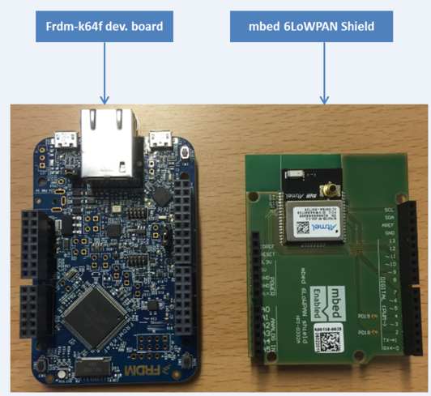

# FRDM-K64F border router
This document describes how to configure, compile, and run a FRDM-K64F 6LoWPAN border router application on a [FRDM-K64F development board](https://www.mbed.com/en/development/hardware/boards/nxp/frdm_k64f/). Instructions for debugging and testing are also provided.

Note: this Border Router does not support Thread.

## Introduction
Border router is a network gateway between a wireless 6LoWPAN mesh network and a backhaul network. It controls and relays traffic between the two networks. In a typical setup, a 6LoWPAN border router is connected to another router in the backhaul network (over Ethernet or a serial line) which in turn forwards traffic to/from the Internet or a private company LAN, for instance.


## Software components
The FRDM-K64F border router application consists of 4 software components as shown in the image below:


* [Nanostack Border Router](https://github.com/ARMmbed/nanostack-border-router) - is the core IPv6 gateway and provides the mesh network functionality.
* [Atmel RF driver](https://github.com/ARMmbed/atmel-rf-driver) - is the driver for the Atmel AT86RF2xxx wireless 6LoWPAN shields.
* [Ethernet driver](https://github.com/ARMmbed/sal-nanostack-driver-k64f-eth) - is the Ethernet driver for the FRDM-K64F development board.
* [SLIP driver](https://github.com/ARMmbed/sal-stack-nanostack-slip) - is a generic Serial Line Internet Protocol version 6 (SLIPv6) driver for mbedOS boards.

## Required hardware
* Two FRDM-K64F development boards - one for the border router application and another one for [the 6LoWPAN mbed client application](https://github.com/ARMmbed/mbed-client-example-6lowpan/).
* Two mbed 6LoWPAN shields (AT86RF212B/[AT86RF233](http://uk.rs-online.com/web/p/radio-frequency-development-kits/9054107/)) - for wireless 6LoWPAN mesh connectivity.
* Two micro-USB cables - to connect the development boards to a PC for debugging and power.
* An Ethernet cable - to connect the development board to a backhaul network.



## Required software
* [Git](https://git-scm.com/) - for fetching the source files from GitHub.
* [yotta](http://docs.yottabuild.org/#installing) - for building the FRDM-K64F border router application.
* [GCC ARM embedded toolchain](https://launchpad.net/gcc-arm-embedded/4.9/4.9-2015-q3-update) - for building the FRDM-K64F border router application.
* [PuTTY](http://www.chiark.greenend.org.uk/~sgtatham/putty/) - for viewing the debug output.

## Configuration
To configure the FRDM-K64F border router you need to make changes in the yotta configuration file `config.json` in the root directory of the source tree. For the complete list of configuration options, please refer to the [Nanostack Border Router](https://github.com/ARMmbed/nanostack-border-router) documentation.

```json
  "k64f-border-router": {
    "backhaul-driver": "ETH",
    "backhaul-mac-src": "CONFIG",
    "backhaul-mac": "{0x02, 0x00, 0x00, 0x00, 0x00, 0x01}"
  },
```

##### Backhaul connectivity
The FRDM-K64F border router application can be connected to a backhaul network. This enables you to connect the devices in a 6LoWPAN mesh network to the Internet or a private LAN. Currently, the application supports SLIP (IPv6 encapsulation over a serial line) and Ethernet backhaul connectivity. You can select your preferred option through the yotta configuration (field *backhaul-driver* in the *k64f-border-router* section). Value `SLIP` includes the SLIP driver, while the value `ETH` compiles the FRDM-K64F border router application with Ethernet backhaul support. You can define the MAC address on the backhaul interface manually through the yotta config (field *backhaul-mac-src* value `CONFIG`). Alternatively, you can use the MAC address provided by the development board (field *backhaul-mac-src* value `BOARD`).

##### Prefix and default route
You need to configure a default route on the backhaul interface to properly forward packets between the backhaul and the 6LoWPAN mesh network. In addition to this, you need to set a backhaul prefix. You can set both either manually through the yotta configuration or automatically at runtime (IPv6 autoconfiguration). By default the border router uses a statically configured backhaul prefix and default route with the `backhaul-bootstrap-mode` set to `NET_IPV6_BOOTSTRAP_STATIC` in the border router's `config.json` file. This mode creates a site-local IPv6 network from where packets cannot be routed outside.

The backhaul bootstrap mode can be changed to dynamic mode with `NET_IPV6_BOOTSTRAP_AUTONOMOUS` where the border router learns the prefix information automatically from an IPv6 gateway in the ethernet segment. For more details on how to set the backhaul prefix and default route, please refer to the [Nanostack Border Router](https://github.com/ARMmbed/nanostack-border-router) documentation.

When using the autonomous mode, you can set the `prefix-from-backhaul` option in yotta configuration to `true` to use the bakchaul prefix on the mesh network side as well. This allows for the mesh nodes to be directly connectable from the outside of the mesh network.

##### Note on the SLIP backhaul driver
You need to use the UART1 serial line of the K64F board with the SLIP driver. See the *pins* section in the project's yotta configuration. To use a different UART line, replace the *SERIAL_TX* and *SERIAL_RX* values with correct TX/RX pin names. For the pin names of your desired UART line, please refer to the [FRDM-K64F documentation](https://developer.mbed.org/platforms/FRDM-K64F/).

Example yotta configuration for the SLIP driver:

```json
  "hardware" : {
    "pins" : {
	  "SERIAL_TX": "PTE0",
	  "SERIAL_RX": "PTE1"
    }
  },
```

## Build instructions
1. Install [yotta](http://docs.yottabuild.org/#installing).
2. Install the necessary compiler toolchains.
3. Download the source code of the FRDM-K64F border router by using Git.
4. Modify the yotta configuration file (`config.json`) to reflect your network setup.
5. In the root directory, select the target device: `yotta target frdm-k64f-gcc`
   (You can try the ARM Compiler, although this is not officially supported at this time: `yotta target frdm-k64f-armcc`)
6. Build the binary: `yotta build`

The binary will be created in the `/build/frdm-k64f-gcc/source/` directory.

## Running the border router application
Locate the binary file `k64f-border-route.bin` in the directory `build/frdm-k64f-gcc/source/` and copy the file to the USB mass storage root of the FRDM-K64F development board. It will be automatically flashed to the MCU. After the flashing process has completed, press the reset button on the development board to start the application. A green light should start blinking to indicate a successful startup.

## Debugging the border router application
To view the debug output of the border router application, you need to connect to the to the development board using a terminal emulation program, such as PuTTY.

In PuTTY:

1. Enter your identified serial port to **Serial line** (for example `/dev/ttyACM0` in Linux or `COM19` in Windows).
2. Set the **Speed** to 115200. 
3. Go to the **Serial** section under **Connection**. 
4. Set the serial line as `115200 8N1 XON/XOFF`.

**Linux tip:** To see which serial port your FRDM-K64F development board is connected to:
```
$ dmesg | grep -i ttyACM
```

In the PuTTY main screen, save the session and click **Open**. This opens a console window showing debug messages from the application. If the console screen is blank, you may need to press the reset button of the board to see the debug information. The debug prints for the border router look something like this in the console:

```
[DBG ][app ]: Using ETHERNET backhaul driver...
[DBG ][brro]: Backhaul driver ID: 0
[DBG ][brro]: RF device ID: 1
[DBG ][brro]: RF interface ID: 0
[DBG ][brro]: Backhaul interface ID: 1
[DBG ][brro]: Backhaul bootstrap started
[DBG ][brro]: Backhaul bootstrap ready, IPv6 = fd00:db8:ff1::ff:fe00:1
[DBG ][brro]: Backhaul default route:
[DBG ][brro]:    prefix:   ::/0
[DBG ][brro]:    next hop: fe80::1
[DBG ][brro]: Backhaul interface addresses:
[DBG ][brro]:    [0] fe80::ff:fe00:1
[DBG ][brro]:    [1] fd00:db8:ff1::ff:fe00:1
[DBG ][brro]: Using 24GHZ radio, type = 2, channel = 12
[DBG ][brro]: RF bootstrap ready, IPv6 = fd00:db8::ff:fe00:face
[DBG ][brro]: RF interface addresses:
[DBG ][brro]:    [0] fe80::ff:fe00:face
[DBG ][brro]:    [1] fe80::fec2:3d00:4:b8a8
[DBG ][brro]:    [2] fd00:db8::ff:fe00:face
```
Note that the border router does not print anything else to the console window after bootstrap in this example application.

The debug prints for the 6LoWPAN node running the `mbed-client-example-6lowpan` application should look something like this after a successful bootstrap:

```
[DBG ][m6La]: init()
[DBG ][m6La]: connect()
[INFO][m6LND]: Start 6LoWPAN ND Bootstrap
[DBG ][m6LND]: app_parse_network_event() 0
[INFO][m6LND]: 6LoWPAN ND bootstrap ready
[DBG ][m6LND]: ND Access Point: fd00:db8::ff:fe00:face
[DBG ][m6LND]: ND Prefix 64: fd:00:0d:b8:00:00:00:00
[DBG ][m6LND]: GP IPv6: fd00:db8::fec2:3d00:4:c762
[DBG ][m6LND]: MAC 16-bit: ff:ff
[DBG ][m6LND]: PAN ID: 07:00
[DBG ][m6LND]: MAC 64-bit: fc:c2:3d:00:00:04:c7:62
[DBG ][m6LND]: IID (Based on MAC 64-bit address): fe:c2:3d:00:00:04:c7:62
[DBG ][m6LND]: Channel: 12
```

## Testing the border router application using Linux
This section describes how to manually verify that the FRDM-K64F border router application is running correctly. For testing mesh network connectivity, you need to connect a node running [mbed-client-example-6lowpan](https://github.com/ARMmbed/mbed-client-example-6lowpan/) in 6LoWPAN ND mode to the network and ping the node's RF interface address from your PC.

1. Configure the [mbed-client-example-6lowpan](https://github.com/ARMmbed/mbed-client-example-6lowpan/#changing-the-radio-channel) to use the same channel as the border router (default: 12). Ensure that `appl_bootstrap_mode_thread` is set to false in the `config.json` file.
2. Compile the `mbed-client-example-6lowpan` application and flash it into one of the development boards as described in [mbed client build instructions](https://github.com/ARMmbed/mbed-client-example-6lowpan/#build-instructions).
3. Edit the border router's `config.json` file by changing the `security-mode` to `NONE`.
4. Compile the border router application and flash it into the second development board.
5. Connect the border router development board with an Ethernet cable to a router or switch.
6. Connect a PC running the Linux operating system to the same router/switch.
7. Connect both development boards to the PC with micro-USB cables. The boards power up and the USB drives get mounted.
8. On the PC, use PuTTY to establish serial connection to both boards.
9. After a successful connection, press the reset button on the border router device. Debug outputs should now be visible in the PuTTY console.
10. On the PC, issue the `ifconfig` command. You should find an IPv6 address with backhaul prefix `fd00:db8:ff1::/64` on your Ethernet interface.
11. Verify that the routes with the backhaul and RF interface prefixes have been added to your Linux routing table: `route -6`.
12. Press the reset button on the board running the mbed client application.
13. After a successful bootstrap you should see the node's RF interface address, for example: `GP IPv6: fd00:db8::fec2:3d00:4:c762`
14. On the PC, ping the RF interface address of the 6LoWPAN node, for example: `ping6 fd00:db8::fec2:3d00:4:c762` and you should see pings going through.
15. You have verified that the FRDM-K64F border router application is routing traffic between the mesh network and backhaul network!

Example output of the `ifconfig` command on the PC:
```
eth0      Link encap:Ethernet  HWaddr 00:27:13:b4:25:46
          inet6 addr: fe80::227:13ff:feb4:2546/64 Scope:Link
          inet6 addr: fd00:db8:ff1:0:227:13ff:feb4:2546/64 Scope:Global
          UP BROADCAST RUNNING MULTICAST  MTU:1500  Metric:1
          ...
```

Example output of the `route` command on the PC:
```
Kernel IPv6 routing table
Destination                    Next Hop                   Flag Met Ref Use If
fd00:db8::/64                  ::                         UAe  256 0     0 eth0
fd00:db8:ff1::/64              ::                         UAe  256 0     0 eth0
```
